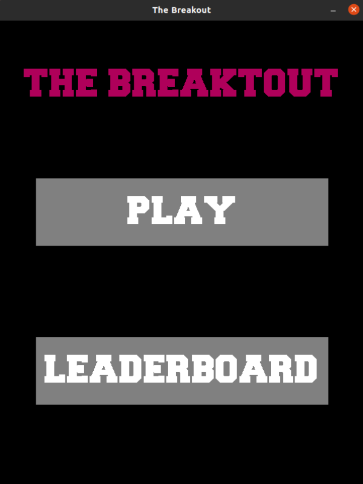

# The Breakout

University project for an introduction to the C programming language. Clone of the game [Breakout](https://link-url-here.org) in the SDL2 library.
## Description

1. The ```"include"``` folder contains all header files.
2. The ```"resources"``` folder contains two files:
    - ```bricks.txt``` text file containg the location of each brick.
      - The first line contains two decimal numbers separated by a space, representing the number of rows and columns.
      - The second line contains two decimal numbers separated by a space that represent the width and height of each brick.
      - Then, for each row, there is a new row containing the X and Y coordinate sequences (decimal numbers separated by a space).
    - ```highscores.txt```
        a text file containing highscores. 
3. The ```"src"``` folder contains source code, makefile, font and a folder for binary files (```"obj"```)

## Source Code:

1. ```gxf.c``` manages rendering
2. ```init.c``` initializes SDL library and game objects
3. ```input.c``` manages mouse and keyboard inputs
4. ```logic.c``` manages game logic
5. ```main.c``` includes game loop
6. ```res.c ``` manages files
7. ```text.c``` includes a text drawing function

## Requirements

- SDL2 library 
  - for Debian-based systems: 
    - ``` $ sudo apt-get install libsdl2-dev ```
    - ``` $ sudo apt-get install libsdl2-ttf-dev ``` 
  - for more detailed information, please see [installation instructions](https://wiki.libsdl.org/SDL2/Installation)
- Unix based OS

## Build Instructions

1. open a terminal in the folder ```"src"```
2. in the terminal type: ``` $ make ```
3. in the terminal type: ``` $ ./breakout ```
4. the game should now be running

You may want to delete binaries created by the ``make`` command.
To do this, open a terminal in the ```"src"``` folder and in the terminal type:
``` $ make clean ```

## Screenshots

|           Menu            |           Gameplay        |        Leaderboard        |
|:-------------------------:|:-------------------------:|:-------------------------:|
||||

---

Last update 09/01/2021.
